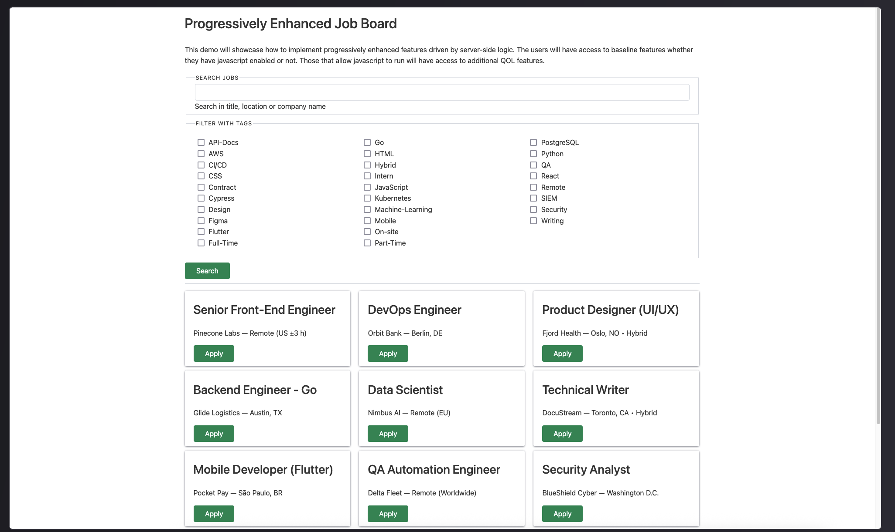
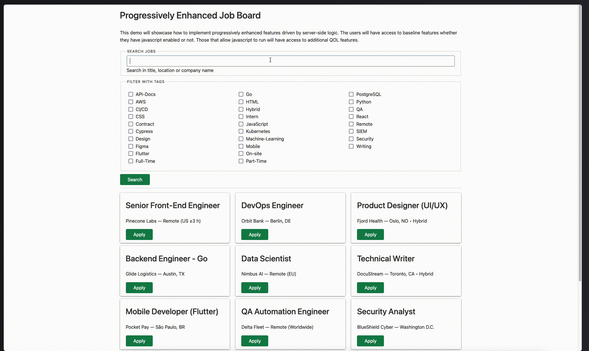
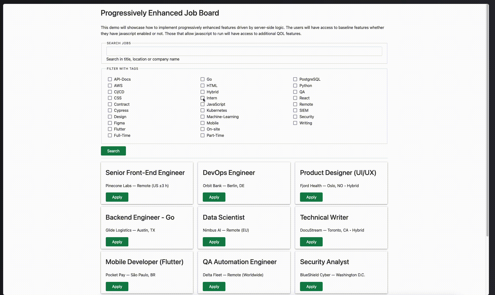

# 🛠 Progressively‑Enhanced Job Board

A tiny Express + SSE demo that shows how to:

* **Progressive enhancement** – full‑function HTML when JavaScript is off; instant refinements (live search, tag filters) when it’s on.
* **Minimal dependencies** – framework‑agnostic UI (Chota ≈ 10 KB), zero front‑end build steps.
* **Strong security posture** – Nginx sets CSP without 'unsafe-inline', serves static files and enforces rate limits; SameSite Strict cookies, CSRF tokens via `csrf-sync`, HTTPS even in dev.
* **Server‑Sent Events** – stateless live updates powered by Node streams.
* **Clean Docker workflow** – one `Dockerfile` + Nginx sidecar for local TLS and eventual prod parity.

## Demo

Current demo is deployed at [https://pp.kaan.io](https://pp.kaan.io). It lives on a digital ocean droplet and it is behind cloudflare dns proxy. This setup requires some alterations to the setup (like modifying the request limits, using proper certs etc) and they are handled in the `*.prod.*` files

<p align="center">
  
</p>

### Instant search (JS enabled)

<p align="center">
  
</p>

### Baseline experience (JS disabled)

<p align="center">
  
</p>


## 🗂 Repository layout

```

.
├─ data/                     # sample JSON data source
│  └─ jobs.sample.json
├─ lib/                      # server modules
│  ├─ jobs.js
│  ├─ render.js
│  ├─ sessions.js
│  └─ util.js
├─ public/
│  ├─ style.css              # tiny add‑on to Chota
│  └─ app.js                 # browser JS (SSE + fetch)
├─ index.js              # express server
├─ docs/                     # screenshots & gifs
├─ test/                     # unit tests
├─ e2e/                      # Playwright specs
├─ docker-compose.yml        # base stack (app + nginx)
├─ docker-compose.dev.yml    # hot‑reload variant
├─ docker-compose.prod.yml   # hardened prod stack
├─ nginx.conf                # dev proxy
├─ nginx.prod.conf           # production proxy
├─ .github/workflows/ci.yml  # CI pipeline
├─ Dockerfile
└─ README.md

````

---

## ⚙️ Daily development loop

We run **everything inside Docker**, even during development, so that TLS, cookies (`Secure` always on), and proxy behaviour match production byte‑for‑byte.

```bash
# Hot‑reload dev stack
docker compose -f docker-compose.dev.yml up --build

# Stop / prune
docker compose -f docker-compose.dev.yml down
```

---

## 🚀 Quick start

> **Prerequisites**
> Docker ≥ 24
>
> Docker Compose v2 (bundled with Docker Desktop / recent Engine)
>
> Node.js 20.x

### 1. Generate a local certificate _(once per machine)_

```bash
mkdir certs
openssl req -x509 -nodes -newkey rsa:2048 \
  -keyout certs/dev.key -out certs/dev.crt -days 825 \
  -subj "/CN=localhost"
````

> macOS users can alternatively run `mkcert -install && mkcert -key-file certs/dev.key -cert-file certs/dev.crt localhost`.

### 2. Build & run

```bash
docker compose up --build
```

* `app` → Node image exposes port **3000** inside the network.
* `nginx` → Alpine Nginx on **[https://localhost:3443](https://localhost:3443)** (TLS) and proxies SSE with buffering disabled.

Visit **[https://localhost:3443](https://localhost:3443)** ‑‑ you’ll see the job board and can live‑filter without page reloads.

### 3. Stop / clean up

```bash
docker compose down
```

---

## 🔑 Nginx config (recap)

```nginx
limit_req_zone $binary_remote_addr zone=req:10m rate=15r/m;  # 60r/m in prod
server {
    listen 80;
    return 301 https://$host$request_uri;
}


server {
    listen 443 ssl;
    server_name localhost;
    # prod: real IP headers + HTTP→HTTPS redirect

    ssl_certificate     /etc/nginx/certs/dev.crt;
    ssl_certificate_key /etc/nginx/certs/dev.key;

    gzip on;
    client_max_body_size 2M;

    add_header X-Content-Type-Options nosniff always;
    add_header X-Frame-Options DENY always;
    add_header Referrer-Policy strict-origin-when-cross-origin always;
    add_header Permissions-Policy "interest-cohort=()" always;
    add_header Strict-Transport-Security "max-age=63072000; includeSubDomains; preload" always;
    add_header Content-Security-Policy "
      default-src 'self';
      connect-src 'self';
      style-src 'self' https://unpkg.com;
      img-src 'self' data:;
      font-src 'self';
      object-src 'none';
      base-uri 'none';
      form-action 'self';
    " always;

    location ~* \.(?:css|js|woff2?|ico|png|svg)$ {
        root /usr/share/nginx/html;
        access_log off;
        expires 1y;
        add_header Cache-Control "public, immutable";
        try_files $uri =404;
    }

    location / {
        limit_req zone=req burst=20 nodelay;
        proxy_pass http://app:3000;
        proxy_set_header Host $host;
        proxy_set_header X-Forwarded-Proto https;
    }

    location /events {
        proxy_pass          http://app:3000;
        proxy_http_version  1.1;
        proxy_set_header    Connection '';
        proxy_buffering     off;
        proxy_cache         off;
        proxy_read_timeout  1h;
        chunked_transfer_encoding on;
        proxy_set_header    Accept-Encoding '';
        gzip off;
    }
}
```

---

## 🔒 Security highlights

| Layer         | Measure                                                                       |
| ------------- | ----------------------------------------------------------------------------- |
| **Transport** | Local TLS via Nginx; production ready for Let’s Encrypt.                      |
| **Cookies**   | `HttpOnly; Secure; SameSite=Strict` |
| **CSRF**      | `csrf-sync` synchroniser token with secret cookie & `x-csrf-token` header.    |
| **CSP**       | Set in Nginx: `default-src 'self'`; external CSS whitelisted with SRI; no `unsafe-inline`.  |
| **XSS**       | Output escaped with `html‑escaper`; URLs validated server‑side.               |
| **Rate limiting** | `limit_req` in Nginx allows 15 req/min locally (60 in production) with a burst of 20. |
| **Static files** | Served by Nginx with 1y immutable cache. |

---

## 🪄 Major features / talking points

1. **Progressive Enhancement:**

   * HTML renders all jobs and tag filters server‑side.
   * JS upgrades: debounced search, SSE push, multi‑column tag layout.

2. **Data pipeline:**

   * Raw JSON ➜ validated on startup ➜ lower‑cased search keys cached.

3. **Server‑Sent Events:**

   * Single `/events` endpoint; pings every 15 s to keep Heroku‑style dynos warm; Nginx pipe kept open with `proxy_read_timeout 1h`.

4. **Zero front‑end build:**

   * Chota CSS pulled via CDN + SRI; additional 20 lines in `public/style.css`.

5. **Slim container images:**

   * Multi‑stage build (npm ci, then copy artefacts). Final image ≈ 90 MB.

---

## 🧞 Handy dev commands

```bash
# Rebuild only the Node image
docker compose build app

# Tail logs for SSE debugging
docker compose logs -f app

# Hot‑reload inside container (nodemon dev variant)
docker compose -f docker-compose.dev.yml up --build
```

---

## 🧪 Running tests

Lint and test commands run locally without Docker.

```bash
# Check code style
npm run lint

# Run unit tests with Node's built-in runner
npm test
```

End-to-end tests rely on the dev stack. Start it in another terminal using the
development compose file, then execute Playwright:

```bash
# Start the application (hot reload)
docker compose -f docker-compose.dev.yml up --build

# In a second shell
npx playwright test
```

---

## 🔄 Continuous integration

The workflow in `.github/workflows/ci.yml` runs on pull requests and every push
to `main`. It performs the following steps:

1. Sets up Node.js 20 and installs dependencies with `npm ci`.
2. Lints the codebase and executes unit tests.
3. Builds the Docker image and starts the Nginx + Node stack.
4. Installs Playwright browsers and runs end-to-end tests.
5. Executes Lighthouse audits using `.lighthouserc.json` (requires the
   `LHCI_GITHUB_APP_TOKEN` secret).

---

## 🏗️ Production deployment

Update `nginx.prod.conf` with your real domain and TLS certificate paths, then
start the hardened compose file:

```bash
docker compose -f docker-compose.prod.yml up --build -d
```

Nginx listens on ports 80 and 443 while the app runs on port 3000 in production
mode.
